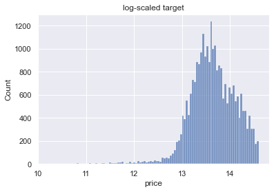

# Need to update file names and links after git clean up


# King County Real Estate Modeling

**Authors**: [Jonathan Fetterolf](mailto:jonathan.fetterolf@gmail.com), [Ilan Haskel NEED EMAIL](mailto:XXXXXXXXXXXXXX), [Nate Kist](mailto:natekist@outlook.com)

## Overview

We analyzed a database of home sales in King County, WA to determine how different housing features impact sales price.  Regression analysis of these sales show potential opportunities for real estate flipping companies to earn more profit by buying in certain areas and adding features to a home that ultimately drive up the resale price more than the cost of the addition.  The analysis determined that buying properties in Skykomish, Algona, Federal Way, Enumclaw, and Auburn would likely result in more return on their investment and that adding a garage for under $38K or adding a patio for under $18K would likely result in higher profit. 

## Business Understanding and Business Problem

Our primary stakeholder is a company called Flipping Seattle, which flips houses in the King County area.  We are analyzing home sales to advise Flipping Seattle on:

 1. What geographic areas should they look in to generate the most return on investment? 
 2. What renovations or additions can be made to their properties to generate more profit upon sale?

## Data Understanding

Data for this analysis is from the following database:

### King County Real Property Sales

The [King County Department of Assessments](https://info.kingcounty.gov/assessor/DataDownload/default.aspx) makes available on its website a dataset representing recent home sales in the county. The initial dataset includes 30,155 home sale records representing sales between 6/10/21 and 6/9/22.  It had 25 columns of data. The column of primary interest is price, as that will be our target in our model.  Other data of interest includes characteristics of the homes sold such as square footage, condition, and the existence of features such as a basement, patio or garage.

## Methods:  Data Preparation and Modeling

We removed unnecessary columns of data that were not used in our analysis, dropped outliers over/under the 1.5x IQR threshold on numerical predictors, and filtered out records with null values.  We also scaled our numberical predictors.  

We created helpful functions that could be reused throughout our code in order to avoid duplication, including drop_outliers(), scale_numberical_cols(), mapping_addressStreet(), mapping_AddressCity(), mapping_is_good_city(), mapping_is_cheap_city(), mapping_hasX(), and mapping_hasView(). 

We utilized the CRISP-DM process for our project, which reprsents an iterative approach. Our workflow ended up consisting of two rounds of modeling.  

### Round one

We started our modeling by performing exploratory analysis with visualizations on potential features to utilize and performing some feature engineering.  Features engineered in round one included 'zipcode' (extracted from address) and 'age_when_sold' ('date' less 'yr_built').  

#### Baseline

Our baseline has price as the target and 'sqft_living', 'sqft_lot', and 'sqft_patio' as predictors.  We recieved an r-squared of .303.  We then plotted the target (price) to view its distribution and we noticed it was slightly right-skewed.  We tried log-scaling price.  We noticed it was even more skewed (now on the left).  When we created a model with the log-scaled price as the target, the r-squared was worse.  As such, we did not use the log-scaled price in any of the rest of our analysis. 

#### Adding numerical predictors

From there, we started trying different combinations of numerical predictors such as square foot lot, square foot patio, and age when sold.  Our r-squared slightly improved (.312) but was still not where we wanted it.  Also, our other summary statistics were getting worse (e.g. Jarque-Bera and condition number).  

#### Adding ordinal categorical predictors

We moved forward with additional nomimal categorical features to see if that would help our model.  We used One Hot Encoder to try differet combinations of categorical features including bathrooms, bedrooms, condition, and heat_source.  

This new model had a slightly higher R-squared score than our previous iteration, but we see the condition number jump up two orders of magnitude, suggesting stronger problems with multicollinearity.  We continue adding features to our model, with the hopes of improving our R-squared score. We decide to incorporate more categorical variables, such as amount of floors, proximity to a waterfront, zipcode, and grade. Before applying them to our model, we first have to one-hot encode these as well. 

It is at this point that we see our R-squared score make a huge jump: our model goes from accounting for only 30% of the variance in our target, to just under 70%. We can conclude that the addition of our new categorical variables is responsible for this improvement.

#### Adding ordinal categorical predictors

It is at this point that we realize that grade, one of the categorical variables incorporated in our current model, should not have been one-hot encoded. Instead, as an ordinal categorical variable, we need to use ordinal encoding to maintain the natural rank order in grade values.  Similarly, condition is a categorical feature being used in our model that should have been ordinally encoded as well. We proceed with re-encoding condition.

####  Drop statistically insignificant values and run new model

Analyzing the p-values corresponding with our model predictors, we notice that some of them are above an alpha of 0.05, suggesting that the perceived relationships these features have with our target are not statistically significant. We proceed by dropping these specific predictors from our model and recreating it.

Ultimately, we find that dropping our insignificant features did not affect model performance very much, nor did it improve our summary statistics pertaining to assumption problems.

#### Modeling result

Our current model's condition number at this point was well above the generally accepted 'danger zone' of approximately 1000. We can gather from this that our predictors have a significant amount of correlation with one another, implying the presence of multicollinearity. Likely, this has to do with the large number of predictors used in our model. A logical improvement given more time is to try and cut down the number of predictor variables used and optimizing our model's R-squared score with its condition number.

### Round two

#### New baseline model

With this prior model for reference, we decided to start over with a new baseline model and create some additional features to use.  Our new baseline model consisted only of one target, price, and one variable, sqft_living. 

New features created in round two included:  'sqft_lot_less_living' ('sqft_lot' less ('sqft_living' / 'floors'), 'has_garage', 'has_patio', 'has_basement', 'has_view', and 'city'.  These features were derived from the values of other features.  For example, if 'square foot garage' was not zero, we concluded that a property had a garage. If it was zero, we concluded it did not have a garage.  We did the same for patio and basement.  If 'view' was not 'NONE', we concluded that the property had a view.  If it was NONE, we concluded it did not.  We extracted city from the address column.   

We paid particular attention to our summary statistics as we went along in round two to make sure we weren't hurting the model as we added features.   

#### Adding numerical predictors

We added 'sqft_lot_less_living' to our former numerical predictors 'sqft_living' and 'age_when_sold'.  This helped our summary statistics a little, but the R-squared was still only .309.  

#### Adding numerical categorical predictors

Next, we took a different approach than the prior round on trying to use location data.  Zipcode was the feature that helped our R-squared the most in the prior round, but it hurt our summary statistics.  We wanted to see if different location data would be better.  We created a new feature for 'city' that we derived from the 'address' feature and we added that to the model.  

This worked out very well. It bumped up our R-Squared from .309 to .607, while keeping out JB score at 6,617 and our condition no. at 199.

We then layered in 'waterfront', 'has_basement', 'has_garage', and 'has_patio'. We saw slight improvements of R-squared to .613, with minimal changes to summary statistics. So far, we have vastly improved our summary statistics from round one while achieving a similar R-Squared.   

#### Adding ordinal categorical predictors

We then tried adding our first ordinal variable 'grade'.  This improved our R-Squared but hurt our JB score.  We concluded that we would not use this variable. 

We then tried the second ordinal variable 'condition'.  This helped our R-squared number, but it hurt our condition no.  We also decided not to use 'condition'.  

#### Adding more categorical variables

We then used the remaining unused nominal categorical variables, adding 'greenbelt', 'nuisace', and 'has_view'.  This looked like the best result we had seen.  Our R-squared is the highest it's been throughout our new round of models while keeping a condition number well under 1000.


## Evaluation / Results

### Checking Model Assumptions

#### Linearity


From our plot, we can gather that the relationship between our target and our predictors is linear.

#### Independence


The upwards trend in this plot suggests a very slight positive correlation in our errors.  
We can confirm by looking at the Durbin-Watson test statistic from our model.

durbin_watson:  1.9885919167316604

This confirms the qualitative conclusion we drew from our scatter plot.
Since the test statistic is below 2.0, we know there to be a very slight positive correlation in our errors.
However, since our test statistic is so close to 2.0, we can confidently say that autocorrelation is not a problem for our regression model.

#### Normality


Upon first glance at our histogram of residuals, our errors appear to be normally distributed.


With normally distributed errors, our plot should follow the diagonal line closely.  
Instead, we see some fairly significant divergences at the extremes. This suggests that our errors may not follow a normal distribution. That said, it is worth noting that divergences from the diagonal line are less extreme than the last time we tested our assumptions in our previous model.

Jarque_beraResult:  7039.654966167089, pvalue=0.0

Based on the large magnitude of our test statistic and a P-value smaller than an alpha of 0.05, we must still reject the null hypothesis that our errors are normally distributed.

Given more time, we may have to make individual histograms for each of our many variables to see their distribution, and possibly transform them in some way or use polynomial features. Unfortunately, this is outside the scope of our current project due to time constraints, and will need further investigation to address our issues with normality of errors.

#### Homoscedasticity


At first glance, our errors appear to have similar variances. This is to say, the spread of our errors does not appear to vary much as our target increases. If anything, the spread may constrain slightly as our target increases, denoted by the larger presence of outliers around the smallest values of our target.

For a more quantitative assessment of homoscedasticity, we employ the Goldfeld-Quant test.  
Result:  (0.9874786620366286, 0.7351101602688859, 'increasing')

The Goldfeld-Quant test has a null hypothesis that homoscedasticity is present in our errors. Since the p-value for our test is greater than an alpha of 0.05, we fail to reject the null hypothesis and cannot gather that heteroscedasticity is a problem with our model.

Turning to the Breusch-Pagan test for a second opinion on whether our data is homoscedastic:

Result:  
         Lagrange multiplier statistic', 2279.3581669918062
         p-value', 0.0
         f-value', 54.12149284620623
         f p-value', 0.0

Since our p-value is smaller than our alpha of 0.05 and our test statistic is quite high for our number of predictors, we must reject the null hypothesis and conclude that there is some evidence to suggest that our errors are heteroscedastic. 

A possible solution would be to transform our target variable in some way, such as log-scaling. However, as seen below, log-scaling our target variable makes its distribution less normal than it is currently.

Before scaling:


After scaling:




#### Independence of Predictors (No Multicollinearity)

Condition_number: 269.39234338796416

Here we see a significant improvement over the previous iteration of our model, starting from the old baseline. Our current model's condition number is well below the generally-accepted 'danger zone' of 1000, suggesting that we eliminated any issues with multicollinearity in our model and that our predictors are sufficiently independent from one another.

### Answering Business Question

Our initial goal was to tease out the features in our dataset that have the highest bearing on price, so as to provide our house-flipping clients information on how to turn the most profit.

**Cheapest Cities**

Upon analysis of our predictor coefficients, we found that city where a house is located has a significant bearing on the price a house will sell for. Knowing that our clients will want to buy cheap in order to minimize property taxes before selling, we were able to ascertain which 5 cities had the highest impact on keeping house price low. In terms of our model, we found the 5 cities with the smallest relative coefficients, meaning that they increased price the *least*. 

Try to buy in the following cities for lowest cost:
1. Skyomish
2. Algona
3. Federal Way
4. Enumclaw
5. Auburn


From our bar graph, we can see that all 5 of these cities have an average house price around or significantly under 600,000 dollars. Comparing this to the mean house price for all cities of over 900,000 dollars, we can see how much cheaper buying a house in any one of these cities would be relative to the mean.

Taking another look at our model summary, we decide to look at the coefficients for our features we think would be easiest for a homeowner to add or adjust. Since garage and patio are both external structures that would be relatively easy for a homeowner to incorporate to their property, we take a look to see if their addition would significantly affect price according to our model. Below are our findings:

**Garage**

According to our model, we are 95% confident that adding a garage will increase value by between 38,000 dollars and 54,000 dollars so to have the highest likelihood of turning a profit, if you can add a garage for under 38,000 dollars, then we believe you should. 


**Patio**

According to our model, we are 95% confident that adding a patio will increase value by between approximately 18,000 dollars and 33,000 dollars, so to have the highest likelihood of turning a profit, if you can add a patio for under 18,000 dollars, then we believe you should.


## For More Information   

See the full analysis in the [Jupyter NotebookXXXXXXXX](./Movie_industry_analysis_notebook.ipynb) or review this [presentation](./presentation.pdf).

**For additional info, contact:**
- Jonathan Fetterolf: jonathan.fetterolf@gmail.com
- Ilan Haskel: ilanhaskel97@gmail.com
- Nate Kist: natekist@outlook.com


## Repository Structure     UPDATE BELOW FOR FINAL GIT FILES !!!!!!!!!!!!

```
├── Scratch_Notebooks
│   ├── matt-prelim.ipynb
│   ├── nate-prelim.ipynb
│   ├── joining-df.ipynb
│   ├── jon-prelim.ipynb
│   └── roshni-prelim.ipynb
├── images
│   ├── cinema.jpeg
│   ├── director_shot.jpeg
│   ├── figure1.png
│   ├── figure2.png
│   ├── figure3.png
│   └── jheader.png
├── zippedData
│   ├── bom.movie_gross.csv.gz
│   ├── im.db.zip
│   ├── rt.movie_info.tsv.gz
│   ├── rt.reviews.tsv.gz
│   ├── tmdb.movies.csv.gz
│   └── tn.movie_budgets.csv.gz
├── Movie_industry_analysis_notebook.ipynb
├── presentation.pdf
└── README.md
```
